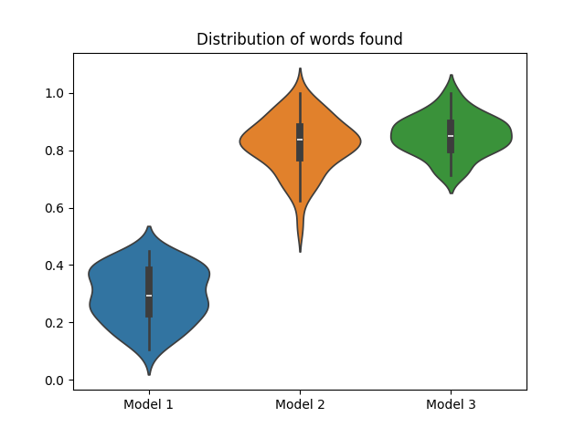
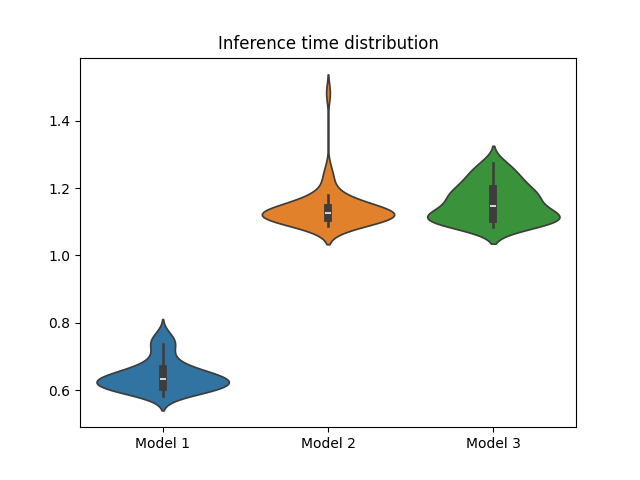
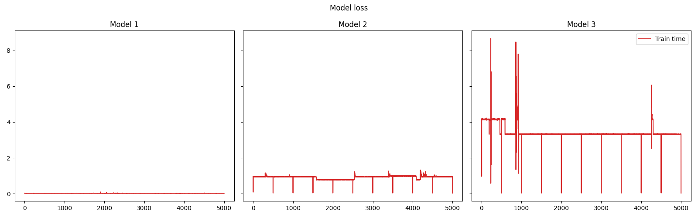
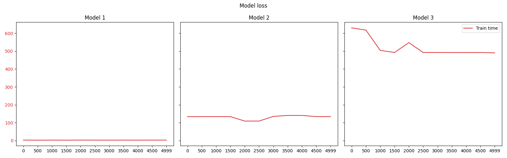
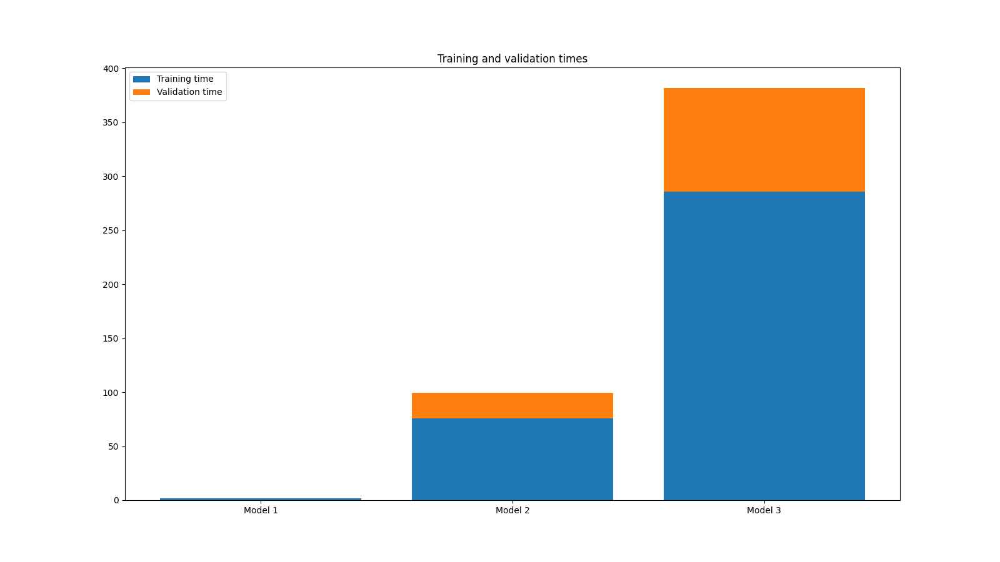
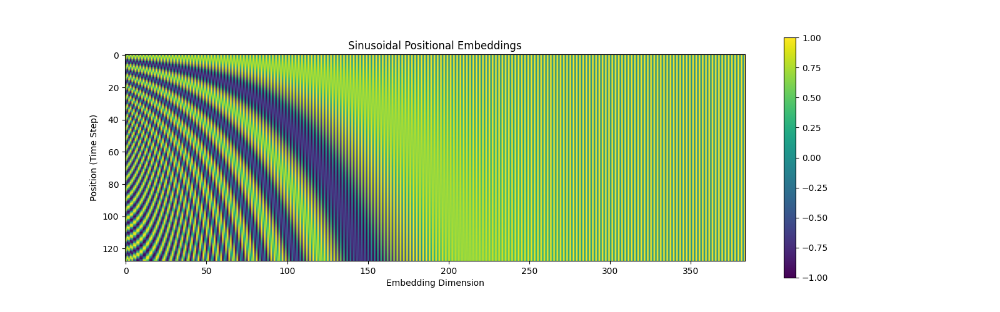

# Project Lab: Deconstructing the transformer

## Introduction

This project contains the construction of a transformer from the ground up using pytorch, with each of the interim deliverables as marked in the "Deconstructing the Transformer.ipynb" notebook.

The final report is contained in this README file, and it explains the methodology followed to understand the complexity between different configurations of the model, as well as the results obtained.

The directory contains:
- A Jupyter notebook with the code, experiments and most of the report information
- A few PNG files with the graphs presented here.
- For each of the three runs there are two files, where the name will spell out the number of batches, blocks, embedding size, heads and layers used for it:
  - a PTH file with the model parameters stored
  - a PKL file with the run parameters for each model

## Experimentation Report

### Methodology

The transformer architecture was built per the instructions above, creating a class for a mini GPT Decoder and as part of that work the Tiny Shakespeare data was loaded to be split into two sets: train and validation.  These sets were used to feed through the transformer network and ajust the weights, but also validate the results on unseen data.

In order to understand the transformer behavior better, three models were built, varying some of the parameters.  The transformer model is tweak by adjusting the following parameters:

- batch size
- block size
- embedding size
- number of heads
- number of layers

So we take three different model complexities and compare their training and validation losses, and also some sort of accuracy metric as explained next.

The train, validation and inference times as plotted as well to understand the time it takes to train/validate/use the model.

### Accuracy function

In order to measure the quality of the words generate, besides using the loss function in the training phase, we approximate how good the model is by seeing how many of the words generated are found on the original text.  This may not be the only metric one would use for this, but for this simple example, it can help to contrast the three models.

$$acc(g) = \frac{| W_g  \cap W_v |}{| W_g |}$$

### First Model

The first model is very simple, using a small batch and block size, and also a small embedding space, with the following settings:

| batch_size | block_size | n_embd | n_head | n_layer |
|:---:|:---:|:---:|:---:|:---:|
| 8 |  4 | 64 | 4 | 3 |

This model in general is able to generate a lot of giberish, but from a quick sample, about 30% of words generated are coming from the original text provided.

#### Output
```
VIUMEFS:
I rent bu, spers, ien; ponis andy, hat but ont bea?
TELI: Is fit iN dot thimend you treay eobs-enrl
vownd; pyoud benest yout hent tromoneed bey, arnd, thers e
Matmes ripee wedllequU
ce to yourch,-parl sthend is iyer
Yhaddedffr bovisbl, hohous Siosh chamy,
NUKES:
Ledes,
Thaker'
So tof dord ethr got hueverd ad in uped:
Go LORHA:
The hand bom none res you crefe: shen ate ewe ID:
I Magatht,
Gag theers cong ofour gpserapene tordeaninge.


RAs iruste!:
Hangerd
He port beber', featbodedan thour brin:
Ce hapor nof ordegede, furgs, youd,; jeiter, morS sowee.
My
Whake fou not ordg lrukivenrse:

Is blence acrmy thy eynenariringisede ethik reatkery aenes;
akting;
Wh stonir son CHad whelyS:
ABie Ieend.
We yof bue, it her drave asade mant, ionrgI ioey moull she nollesthe, mou elotith diadmenrso movitir? you cut, wis
On!
Why liRgh mob, thour hath beravanche ado pred,
'e too heeeeiner.


KIUK:
Cer mie good is cun hcof dedir fotee sitgorsoprlt ourot hrur.
Iss vedith
Bush,-
ve:
For aiomees, a;
```

### Second Model

The second model is more complex,, using a larger  batch and block size, and also creating a much larger embedding space, with the following settings:

| batch_size | block_size | n_embd | n_head | n_layer |
|:---:|:---:|:---:|:---:|:---:|
| 32 |  128 | 384 | 6 | 4 |

This model in general is able to generate better words, even if the text completely doesn't make a lot of sense from a quick sample, about 79% of words generated are coming from the original text provided.

#### Output
```
VOLUMNIUS:
Now in nights;
Hath breen beneformitious to suffer me throne.
Have we here, I they lieged it greets in my brows;
And this I shoot do Warwick thus on him.

BISHOP OF MARWISLIA:
I have bed saved.
By my promise, come nowry.


FRIAR SICHOP MENENIUS:
Whom he, he shall be to log be one,
Him that place you sit to at your high'd.

BUCKINGHAM:
You will might thought'st log in here into me
Sin fone purposes the happor gave to myself
Is has up the order talks fortune:
You have mind addmnabling rights and come behind
Touchsafe, he name war to thee about's good.

Second Warwick, Camillo.

RICHMOMEO:
I were conqued, it seelf; your chensied no more
let a suitor, nor more my sonselesst me injest,
And never shall boaring proph'd understing to see
As'd our abidence slabes, then now Hail,
That as your fellior right in that life,
Go would hid he firm mercistacl'd.

Second Callifford:
He had his conveyal with him.

BRUTUS:
No, put the house of the wealthil.

Shepherd:
Away, your chardinesss
Cimi
```

### Third Model
The third model is the most complex of all with double the batch and block sizes, and same embedding space as the previous model, with the following settings:
  
| batch_size | block_size | n_embd | n_head | n_layer |
|:---:|:---:|:---:|:---:|:---:|
| 64 |  256 | 384 | 6 | 4 |

This model in general is the highest rated with about 85% of words generated are coming from the original text provided.


#### Output
```
Now, by this trough will make heart of those fate,
Before ourself walks, changed and fiend, that he
Narth purpose much more in worm.

OXFOR:
Richerd outrates, thy numble steeds avalone,
To black hart ic in sonsellor, and his palm.

HERMIONE:
Will thou, troubly, sirst to up, when never to all,
Into were death, sir, it were a glove in a Rome.

WARWICK:
And youngry son, fell then,
Peisus no good fall cat him distry.
But Fell him shall, we have are reason,
I master for repentitence myself.
The state frather, be removed and the king arth,
And, bring and few first to down.
So mee, unless  love what pain'd a child of women,
That are toempens and upon this browl guilt:
With cursets are stretching a pereseth-roone duke.

KING RICHARD II:
Methinks I hot would I vo dend thee ill,
Conceit this fault for the earth.
KING RICHARD III:
O no staby to of descree, a noble of thy death:
Is the coutst-or-whisty more doth,
To be coward tex of this prince and
Did rinkind whose deters death of Northily knifes
```

### Results

#### Generated words found in original vocabulary

In general, it's easy to see that if the model gets more complex, the performance will most likely get better, in the chart, you can see an improvement from Model 1 to Models 2 and 3, however, just a slight difference in the mean between Models 2 and 3.



#### Inference time

Another important metric to look at is inference time.  For this particular scenario, inference time was calculated for 50 samples of 100 words each, and for each of those samples the inference time for all models was below 2 seconds.  Specifically, Model 1 is very fast, less than 0.7 seconds in average for those 100 characters, while Models 2 and 3 have similar distributions with around 1.2 secods for the inference, but it can be see that there are times when the inference can lag up to 1.8 seconds.



#### Losses

It can be seen that Model 1 converged early to a loss around 2.4, but would definitely not make better progress, while Models 2 and 3 had smaller losses after the 5,000 iterations.  Unfortunately, even after achieving a smaller loss, Model 3 still performs similarly as Model 2 when presented with unknown data, so the model did overfit the training data.


#### Train times

Clearly, as the model gets more complex, training time will grow, in this case, each iteration would take close to 3.5 seconds per iteration for Model 3, which was the highest value, Model 2 was much faster around 1 second per iteration, while Model 1 was extremely fast.  As we will see, this is not the highest cost on traning the model.



#### Eval times

For evey certain training iterations as we calculated an estimated validation and training loss, and running through the model for each of the 200 samples took around 8 minutes in average for Model 3, for model 2 around 2 minutes, and for Model 1 almost unnoticeable.



#### Total eval and train times

Total times can bee seen in the graph, without question, the more complex model, exponentially outgrows the simpler one, just by adding layers and sizes to the blocks and batch sizes



### Analysis Questions (Include in Report)

1. **Scaling:** Why do we divide by $\sqrt{d_k}$ in the attention formula? What happens to the Softmax gradients if we don't?

Given that we are multiplying the Query and Key matrices before normalization, assuming that these matrices are 0 mean and variance of 1, we would be exploding the values in the multiplication now making the variance $d_k$.  This would also affect the softmax function, by making it output larger, the softmax output will get to a place where gradients explode

2. **Positional Encoding:** Why do we add positional encodings to the embeddings rather than concatenating them?

Positional embeddings provide addition information to the model as to where certain words/letters appear respect to others.  If we were to concatenate the matrices, we would be adding more computation complexity to the model, so instead of having a matrix of $d_model + d_pos$, we can just add the embeddings to the $d_model$ matrix, and even though this will get baked into the model, it will be able to eventually learn this subtle additions.

Here's a visualization of how positional encoding looks across time and embeddings:



3. **Complexity:** What is the Big-O time complexity of the Self-Attention mechanism with respect to the sequence length $T$? Why is this a problem for very long texts?

The complexity of the self-attention calculation is $O(T^2 \cdot d)$, and this is because to calculate the relation between a token and every other token we have to multiply a matrix $T \times T$, so if a sentence grows, say twice the size, $T$ will also grow and the attention calculation quadruples